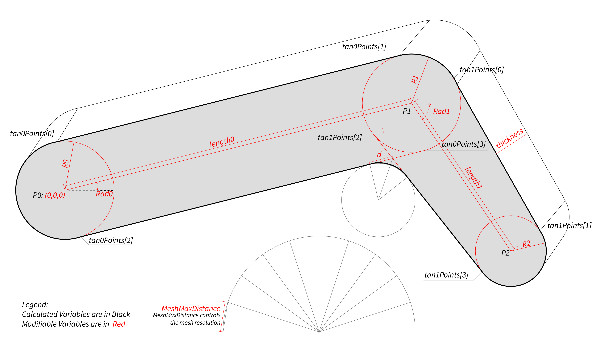

# An Arm Model by libigl

This project is built based on the [libigl template repository](https://github.com/libigl/libigl-example-project). 

A simple arm is modeled and displayed interactively based on libigl and its dependencies.

---

## Platform
Development platform was `WSL2` with `Ubuntu 22.04.2 LTS`. Designed for every platform that supports `cmake` and `glfw`.

## Compile

Compile this project using the standard cmake routine:

    mkdir build
    cd build
    cmake ..
    make

## Run

From within the `build` directory just issue:

    ./arm

A glfw app should launch displaying a the arm with a list of `ImGui::DragScalar` that allows you modify the arm parametrically.

## Dependencies
This small project only activated below dependencies:

- `igl::glfw`
- `igl::imgui`
- `igl::opengl`

## Credits
This package was created by Zac Zhuo Zhang <zhuzhang@student.ethz.ch>.

